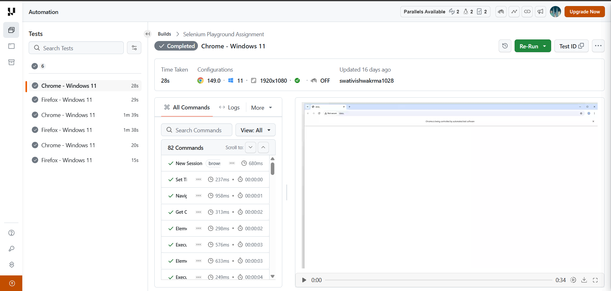

# 🚀 TestMu Selenium 101 Assignment

> A Selenium Web Automation project developed as part of the **TestMu AI Certified Professional – Selenium 101 Certification**.


---

# 📖 About the Project

This project was developed as part of the **TestMu AI Certified Professional – Selenium 101 Certification** to demonstrate practical web automation skills using **Selenium WebDriver**.

The framework is built using **Java**, **Selenium WebDriver**, **TestNG**, **Maven**, and follows the **Page Object Model (POM)** design pattern to create clean, reusable, and maintainable automation scripts.

The automation suite is executed on **LambdaTest Cloud** using **RemoteWebDriver**, enabling cross-browser testing on **Chrome** and **Firefox**.

---

# 🛠️ Tech Stack

- ☕ Java
- 🌐 Selenium WebDriver
- ☁️ RemoteWebDriver
- ✅ TestNG
- 📦 Maven
- 🏗️ Page Object Model (POM)
- 💻 Eclipse IDE
- ☁️ LambdaTest Cloud
- 🔄 Git & GitHub

---

# 📂 Project Structure

```text
testmu-selenium-assignment
│
├── docs
│   └── lambdatest-dashboard.png
│
├── src
│   ├── main
│   │   └── java
│   │       ├── pages
│   │       │   ├── BasePage.java
│   │       │   ├── HomePage.java
│   │       │   ├── SimpleFormPage.java
│   │       │   ├── InputFormPage.java
│   │       │   └── DragDropSliderPage.java
│   │       │
│   │       └── utils
│   │           └── DriverFactory.java
│   │
│   └── test
│       └── java
│           └── tests
│               ├── BaseTest.java
│               ├── SimpleFormTest.java
│               ├── InputFormTest.java
│               └── SliderTest.java
│
├── pom.xml
├── testng.xml
├── README.md
└── .gitignore
```

---

# 🏗️ Framework Design

This project follows the **Page Object Model (POM)** design pattern to improve code maintainability and reusability.

### 📁 pages
Contains page classes responsible for:
- Web element locators
- User interactions
- Page-specific methods

### 📁 tests
Contains TestNG test classes that validate application functionality.

### 📁 utils
Contains reusable utility classes.

Current utility:
- **DriverFactory** – Initializes `RemoteWebDriver` sessions on LambdaTest Cloud.

---

# ⚙️ Framework Workflow

```text
TestNG Test Cases
        │
        ▼
BaseTest
        │
        ▼
DriverFactory
        │
        ▼
RemoteWebDriver
        │
        ▼
LambdaTest Cloud
        │
        ▼
Chrome / Firefox Browser
        │
        ▼
Page Object Classes
        │
        ▼
Assertions
        │
        ▼
Test Results
```

---

# ✅ Automated Test Scenarios

### ✔ Simple Form Demo
- Navigate to the Simple Form page
- Enter a message
- Click **Get Checked Value**
- Verify the displayed message

---

### ✔ Input Form Submit
- Fill all mandatory fields
- Submit the form
- Validate successful submission

---

### ✔ Drag & Drop Slider
- Navigate to the Slider page
- Drag the slider to the required value
- Verify the updated slider value

---

# 📊 LambdaTest Execution Dashboard

The automation suite was successfully executed on **LambdaTest Cloud** using **RemoteWebDriver** across multiple browser configurations.

The dashboard includes:

- ✅ Browser video recordings
- ✅ Cross-browser execution
- ✅ Console logs
- ✅ Network logs
- ✅ Visual step screenshots
- ✅ Command execution logs


---

# 🎥 Test Execution Videos

### ▶️ Test Execution 1
https://github.com/user-attachments/assets/f9c8e872-79ba-4420-aef3-9435d9226006

---

### ▶️ Test Execution 2
https://github.com/user-attachments/assets/a45adae8-d5ab-4d50-a3a1-d34445fc4e68

---

### ▶️ Test Execution 3
https://github.com/user-attachments/assets/339e5787-e811-4df1-bba2-f391cab525ee

---

### ▶️ Test Execution 4
https://github.com/user-attachments/assets/0bca795b-14a9-4c62-89da-9d886f474f64

---

### ▶️ Test Execution 5
https://github.com/user-attachments/assets/dc6b9272-d77d-4849-a3ed-9a89788a1d62

---

### ▶️ Test Execution 6
https://github.com/user-attachments/assets/3032a430-1a0c-4882-8b8d-332a83b4096e

---

# 📈 Test Execution Summary

| Feature | Details |
|----------|---------|
| Test Framework | TestNG |
| Automation Tool | Selenium WebDriver |
| Execution Platform | LambdaTest Cloud |
| Driver | RemoteWebDriver |
| Browsers | Chrome & Firefox |
| Operating System | Windows 11 |
| Design Pattern | Page Object Model (POM) |
| Build Tool | Maven |
| Status | ✅ Successfully Executed |

---

# ▶️ Getting Started

## Prerequisites

- Java JDK 17+
- Eclipse IDE
- Maven
- LambdaTest Account
- Git

---

## Clone Repository

```bash
git clone https://github.com/Swati-Vishwakarma10/testmu-selenium-assignment.git
```

---

## Navigate to the Project

```bash
cd testmu-selenium-assignment
```

---

## Install Dependencies

```bash
mvn clean install
```

---

## Configure LambdaTest Credentials

Set the following environment variables:

```text
LT_USERNAME=your_username
LT_ACCESS_KEY=your_access_key
```

---

## Execute the Test Suite

Run all tests using Maven:

```bash
mvn test
```

Or execute the TestNG suite:

```bash
testng testng.xml
```

---

# 🌟 Project Highlights

- Selenium WebDriver Automation
- RemoteWebDriver with LambdaTest Cloud
- Cross-Browser Testing
- TestNG Framework
- Maven Build Management
- Page Object Model (POM)
- Browser Video Recording
- Console Logs
- Network Logs
- Visual Step Screenshots
- Modular Framework Design
- Easy to Maintain & Extend

---

# 📚 Key Learnings

Through this certification assignment, I gained practical experience in:

- Selenium WebDriver
- RemoteWebDriver
- LambdaTest Cloud
- Cross-Browser Testing
- TestNG Framework
- Page Object Model (POM)
- Browser Automation
- Assertions & Validation
- Maven Dependency Management
- Git & GitHub Version Control

---

# 🚀 Future Enhancements

- Data-Driven Testing
- Parallel Test Execution
- Extent Reports
- Allure Reports
- Screenshot Capture on Failure
- Jenkins CI/CD Integration
- GitHub Actions
- WebDriverManager Integration

---

# 🏆 Certification

This project was completed as part of the **TestMu AI Certified Professional – Selenium 101 Certification**.

- ✅ Successfully Completed
- 📊 Score: **70%**
- 📅 Certificate Valid for **2 Years**

---

# 👩‍💻 Author

**Swati Vishwakarma**

- 💻 GitHub: https://github.com/Swati-Vishwakarma10
- 💼 LinkedIn: https://www.linkedin.com/in/swati-vishwakarma-b30157256/

---

## ⭐ If you found this project helpful, consider giving it a Star!

Thank you for visiting my repository! 😊
